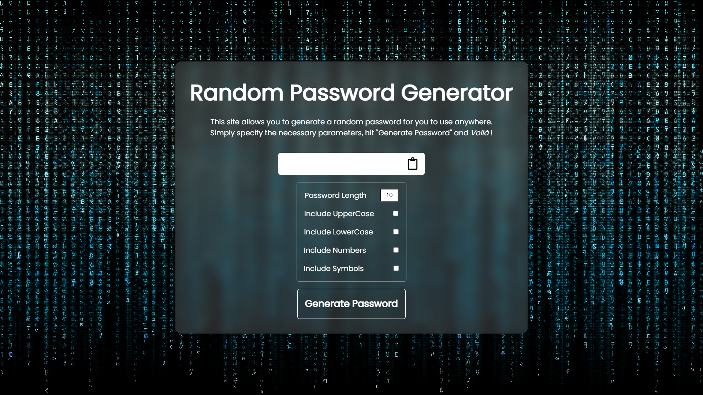

# Random Password Generator
This is a simple password generator that takes multiple parameters as arguments, and produces a randomly-generated password based on those parameters. 

The original creator of this project is <a href="https://github.com/Iam-SilentEyes">@Iam-SilentEyes</a>.
## To-Do
<ul>
<li>Fix clipboard function</li>
</ul>
